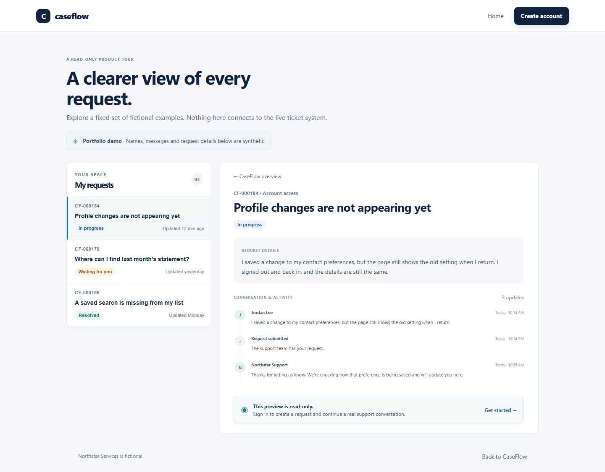

# CaseFlow

CaseFlow is a customer-support ticketing portfolio app for **Northstar Services**, a fictional company. It demonstrates customer requests, a shared support queue, private staff notes, and a public read-only product tour. It is not affiliated with a financial institution and must only contain synthetic data.

**Live demo:** [caseflow-mi6l.onrender.com](https://caseflow-mi6l.onrender.com/). The public homepage is live on Render; the demo is available at [/demo](https://caseflow-mi6l.onrender.com/demo).



## Project status

Milestones M0–M5 are implemented: application foundation, authentication, customer tickets, support workflow, read-only demo, and security/quality hardening. The app is deployed on Render at the live demo URL above. The GitHub Actions deployment workflow remains gated until its required secrets and service variable are configured. See the [product and technical specification](docs/CASEFLOW_PRODUCT_TECHNICAL_SPEC.md), [deployment runbook](docs/CASEFLOW_DEPLOYMENT_RUNBOOK.md), and [implementation decisions](docs/ADR-001-implementation-clarifications.md).

## Architecture

```text
Browser (one origin)
  ├── React + TypeScript + Vite
  └── FastAPI /api/v1 + health + OpenAPI
       ├── Argon2id passwords; opaque sessions; per-session CSRF
       └── PostgreSQL 16 + Alembic migrations
```

Production uses a multi-stage Docker build and serves the compiled SPA from FastAPI. PostgreSQL is the only persistent store. The hosted target is Render for the web service and Neon for PostgreSQL. Local Compose maps PostgreSQL to host port 5433.

## Run locally

Requirements: Docker Engine/Desktop with Compose, Python 3.12, Node.js 22.12+, and uv 0.12.21.

Run the complete production-like app:

```powershell
docker compose up --build
```

Open `http://localhost:8000`; `/demo` is a read-only tour with fixed fictional examples. Stop with `Ctrl+C`; `docker compose down` stops containers while keeping the local database volume. To remove the local database volume too, use `docker compose down --volumes`.

For Vite development, copy `.env.example` to `.env`, start the local database, then run:

```powershell
docker compose up -d db
Set-Location backend
uv sync --locked --all-groups
uv run alembic upgrade head
uv run uvicorn app.main:app --reload --app-dir .
```

In a second terminal:

```powershell
Set-Location frontend
npm ci
npm run dev
```

Open `http://localhost:5173`. Vite proxies API, docs, and health requests to FastAPI. Never commit `.env` or use its development values in production.

## Main workflows

- Customers can register, sign in, submit requests, review their timeline, reply, reopen resolved requests, and see their own requests only.
- Agents can review and claim the shared queue, change status/priority, respond publicly, add staff-only notes, and resolve requests.
- Admins can also reassign work and close requests.
- Staff accounts are provisioned outside public signup with `uv run python -m app.scripts.provision_staff`; set the documented `CASEFLOW_STAFF_*` values in a trusted terminal. Never publish or reuse real credentials.
- `/demo` shows fixed synthetic examples, has no write controls, and does not fetch live ticket data.

## Quality checks

```powershell
Set-Location backend
uv run --locked ruff check app tests alembic
uv run --locked mypy app
uv run --locked pytest

Set-Location ..\frontend
npm ci
npm run lint
npm run typecheck
npm test
npm run build
npm audit --audit-level=high
npm run test:e2e
```

Backend integration tests use PostgreSQL. The Playwright journey provisions disposable local customer and agent accounts, exercises registration through resolution/reopen, verifies private-note isolation, and removes its test records afterward. Run it against the local Compose stack; the CI workflow starts and removes its own stack. GitHub Actions also checks Alembic parity, audits dependencies, and builds the production container. Production deploys run only after successful main-branch CI and only after the required GitHub secrets and service variable have been configured.

## Security and operational limits

- One HTTPS origin, HttpOnly server-managed session cookies, CSRF and same-origin checks, and backend role/ownership enforcement.
- Rate limits, request-size checks, structured redacted request logs, security headers, and database statement/idle-transaction timeouts are enabled.
- In-process abuse limits reset on restart and suit one app instance; a shared rate-limit store is needed before scaling to multiple instances or treating this as a real service.
- Email verification, password reset, and distributed abuse controls are not implemented. Do not enter real customer, payment-card, or financial account data.
- Apply schema changes with Alembic; the app does not create schema on startup.
- Render filesystem is not used to store application data. PostgreSQL holds ticket state.

## Deployment handoff

The live Render deployment is available at [caseflow-mi6l.onrender.com](https://caseflow-mi6l.onrender.com/). The GitHub Actions deployment workflow expects GitHub secret `PROD_DATABASE_URL_DIRECT`, secret `RENDER_DEPLOY_HOOK_URL`, secret `RENDER_API_KEY`, and repository variable `RENDER_SERVICE_ID`; automated workflow deployments remain skipped until those are configured for the production Neon database and Render service. Follow the [deployment runbook](docs/CASEFLOW_DEPLOYMENT_RUNBOOK.md); do not paste secret values into chat or Git.
